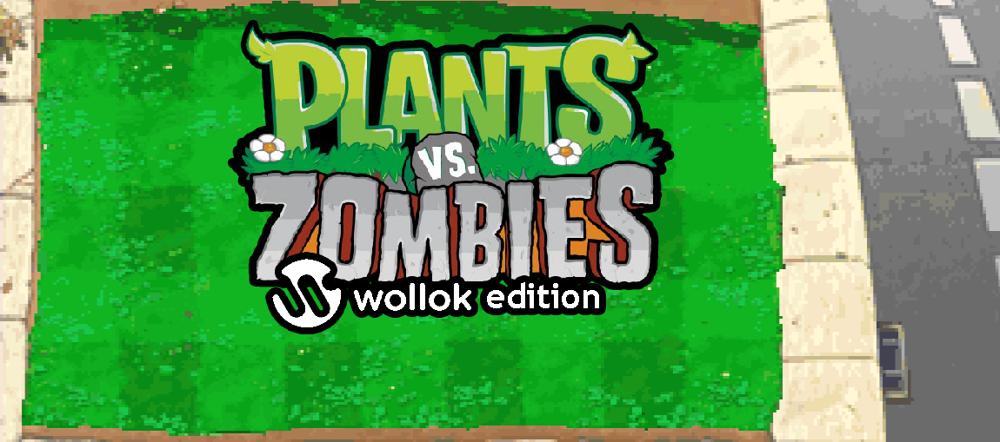
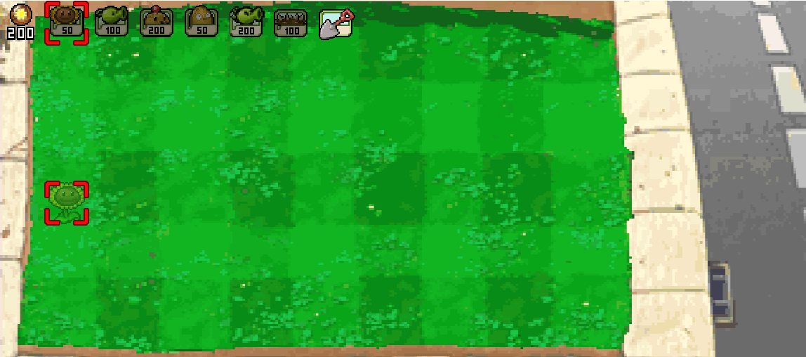
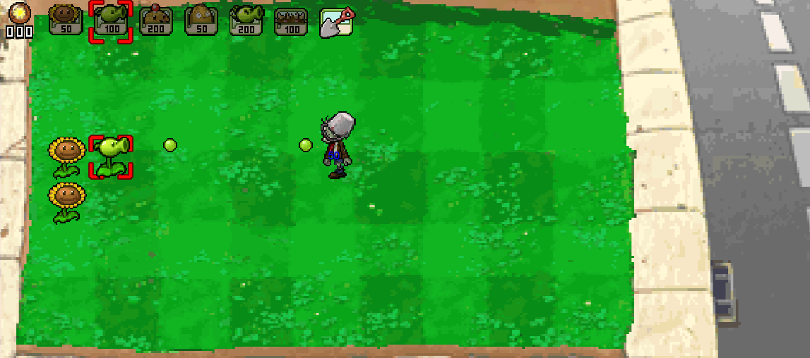
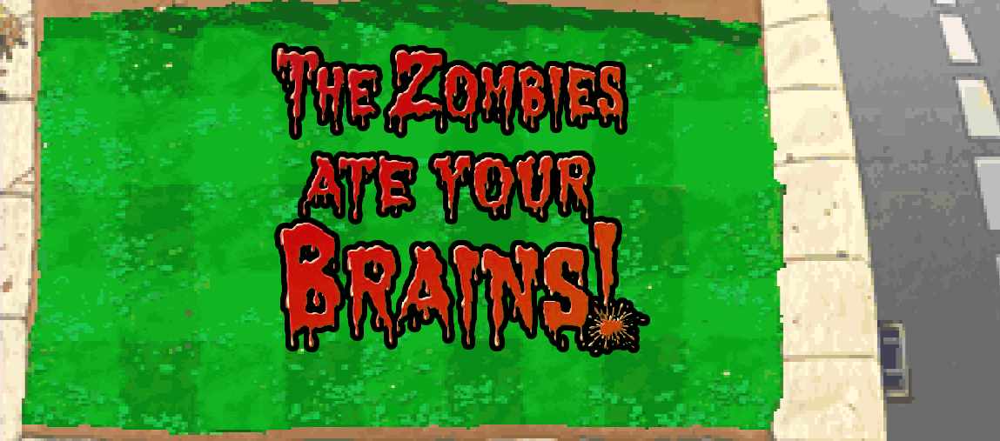
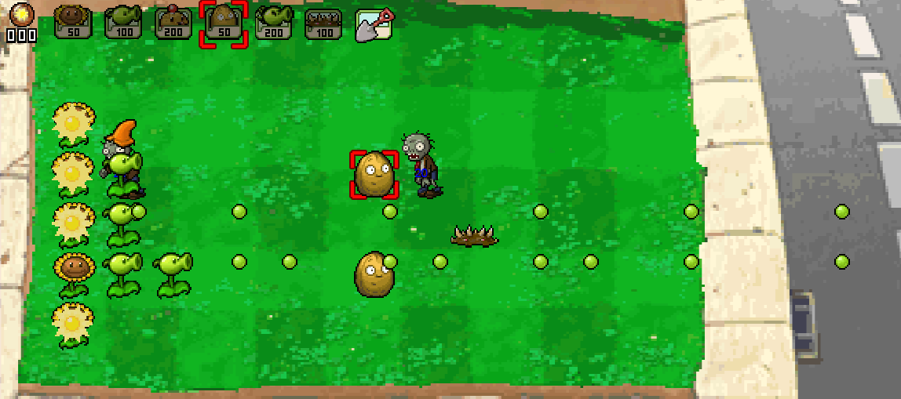

# Plants vs Zombies (Wollok Edition)

## Equipo de desarrollo

- Javier Asato
- Pablo Israelsky
- Vanina Olson
- Franco Orellana
- Hector Ignacio Rzeszut

## Capturas
### Pantalla de inicio

### Comienzo de la partida

### Game Over

### Partida De Ejemplo

## Reglas de Juego / Instrucciones

Matá a todos los zombies para ganar

Si los zombies llegan a la casa del loco dave, perdés

### Controles:

Comenzar partida: Enter

Plantar/Desplantar: Espacio / Espacio con la pala seleccionada

Mover Cabezal: Flechas direccionales

Seleccionar planta: Q / E

## Otros

- Comision mañana - Programación Orientada A Objetos 1
- Una vez terminado, no tenemos problemas en que el repositorio sea público
